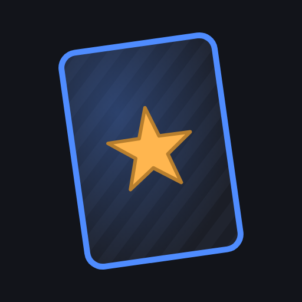
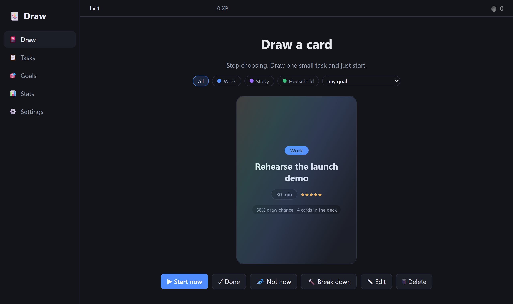
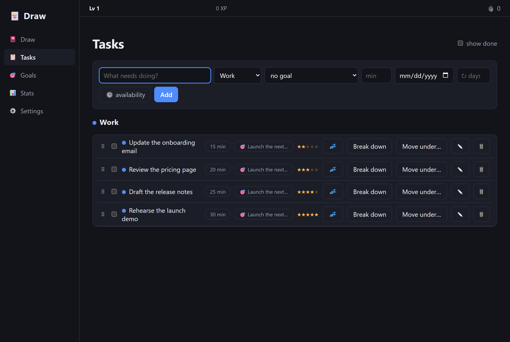
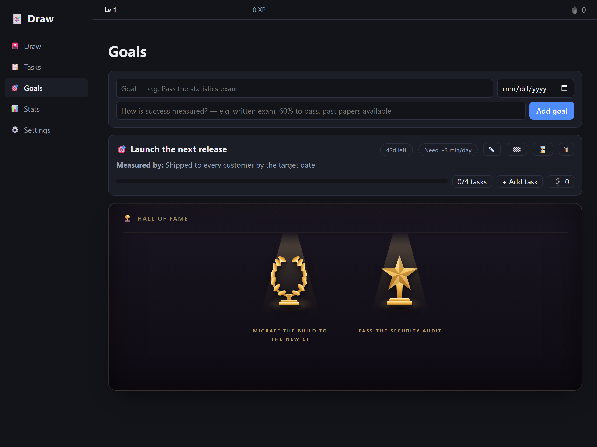

<div align="center">



# Draw

**A task planner that picks your next task for you.**

Every task is small and estimated. When you're ready to work, Draw deals one
as a card — a weighted random pick over everything you could start right now.



</div>

## How the pick works

```
weight = impact² / effort × urgency × staleness
```

- **impact²** — tasks linked to a goal carry a 1–5★ impact rating; a 5★ task is
  ~25× likelier than a 1★ of the same size
- **÷ effort** — smaller tasks surface more often
- **urgency** — ramps up through the last week before a due date, peaks overdue
- **staleness** — the longer a task sits untouched, the louder it gets

One card at a time: a drawn card is resolved — done, snoozed, or deleted —
never re-rolled. Filters for category and goal scope the next draw, and the
category scope is sticky per device.

## The board behind the deck

<div align="center">

</div>

- **Capture fast** — title, Enter, next thought; estimate and categorize later
- **Keep tasks small** — anything over the draw limit (30 min by default) gets
  broken into steps, by hand or by Claude; step order can be enforced
- **Scheduling** — due dates, recurring tasks, and per-weekday availability
  windows; snoozed and blocked tasks leave the deck and come back on their own
- **Time tracking** — one running timer, a focus view with a countdown sized to
  the estimate, and an estimates-vs-reality report on the Stats page

## Goals with a measured outcome

<div align="center">

</div>

A goal is a title plus *how success is measured*. Tasks link to it, carry the
impact rating the draw weights by, and a burn-down chip computes the daily pace
the remaining work actually requires. Finished goals earn a trophy in the Hall
of Fame — one of six designs, assigned per goal. Completions also pay XP with
levels, day streaks with rest days and streak freezes, and collectible
achievement cards.

## Run it

```bash
npm install && npm run dev
```

Open http://localhost:5173. Data is a single SQLite file (`server/data/app.db`).
Requires Node.js 22+.

## Self-host it

```bash
docker compose up -d
```

One container, one volume, any Docker host — images are published multi-arch
(amd64/arm64) to `ghcr.io/felixgeisler/draw`. Set `DRAW_PASSWORD` before
putting it on a network; put [Tailscale](https://tailscale.com) in front for
HTTPS, which also makes it installable as a phone app (PWA). The
**[deployment guide](https://felixgeisler.github.io/draw/docs/07_deployment_view.html)**
covers all of it: TLS, backups, upgrades, and MCP client setup.

AI features stay off until an `ANTHROPIC_API_KEY` is configured — every call
shows a cost estimate first. Everything else works without one.

## Use it from Claude

Draw ships an [MCP](https://modelcontextprotocol.io/) server over the same API
the UI uses: *"what should I do right now?"*, *"import this syllabus as
tasks"*, and *"break this down"* work from a conversation in Claude Code or
Claude Desktop.

## Under the hood

React · TypeScript · Vite · TanStack Query · Express 5 · SQLite
(better-sqlite3) · Claude API for planning · MCP over stdio.

Derived state over stored state: drawability, XP, levels, streaks and trophy
assignments are computed from the facts, never kept as counters.

**[Architecture documentation](https://felixgeisler.github.io/draw/)** —
arc42, with a decision record for every non-obvious choice. Contributing
conventions are in [CONTRIBUTING.md](CONTRIBUTING.md).
